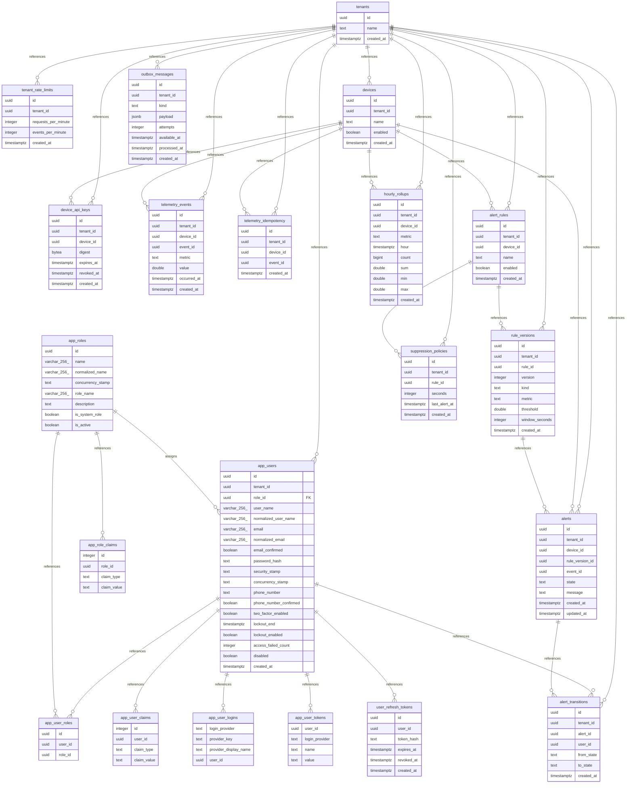

# Database ERD

```mermaid
erDiagram
    tenants {
        uuid id
        text name
        timestamptz created_at
    }
    tenant_rate_limits {
        uuid id
        uuid tenant_id
        integer requests_per_minute
        integer events_per_minute
        timestamptz created_at
    }
    app_users {
        uuid id
        uuid tenant_id
        uuid role_id FK
        varchar_256_ user_name
        varchar_256_ normalized_user_name
        varchar_256_ email
        varchar_256_ normalized_email
        boolean email_confirmed
        text password_hash
        text security_stamp
        text concurrency_stamp
        text phone_number
        boolean phone_number_confirmed
        boolean two_factor_enabled
        timestamptz lockout_end
        boolean lockout_enabled
        integer access_failed_count
        boolean disabled
        timestamptz created_at
    }
    app_roles {
        uuid id
        varchar_256_ name
        varchar_256_ normalized_name
        text concurrency_stamp
        varchar_256_ role_name
        text description
        boolean is_system_role
        boolean is_active
    }
    app_user_roles {
        uuid id
        uuid user_id
        uuid role_id
    }
    app_user_claims {
        integer id
        uuid user_id
        text claim_type
        text claim_value
    }
    app_role_claims {
        integer id
        uuid role_id
        text claim_type
        text claim_value
    }
    app_user_logins {
        text login_provider
        text provider_key
        text provider_display_name
        uuid user_id
    }
    app_user_tokens {
        uuid user_id
        text login_provider
        text name
        text value
    }
    user_refresh_tokens {
        uuid id
        uuid user_id
        text token_hash
        timestamptz expires_at
        timestamptz revoked_at
        timestamptz created_at
    }
    devices {
        uuid id
        uuid tenant_id
        text name
        boolean enabled
        timestamptz created_at
    }
    device_api_keys {
        uuid id
        uuid tenant_id
        uuid device_id
        bytea digest
        timestamptz expires_at
        timestamptz revoked_at
        timestamptz created_at
    }
    telemetry_events {
        uuid id
        uuid tenant_id
        uuid device_id
        uuid event_id
        text metric
        double value
        timestamptz occurred_at
        timestamptz created_at
    }
    telemetry_idempotency {
        uuid id
        uuid tenant_id
        uuid device_id
        uuid event_id
        timestamptz created_at
    }
    alert_rules {
        uuid id
        uuid tenant_id
        uuid device_id
        text name
        boolean enabled
        timestamptz created_at
    }
    rule_versions {
        uuid id
        uuid tenant_id
        uuid rule_id
        integer version
        text kind
        text metric
        double threshold
        integer window_seconds
        timestamptz created_at
    }
    suppression_policies {
        uuid id
        uuid tenant_id
        uuid rule_id
        integer seconds
        timestamptz last_alert_at
        timestamptz created_at
    }
    alerts {
        uuid id
        uuid tenant_id
        uuid device_id
        uuid rule_version_id
        uuid event_id
        text state
        text message
        timestamptz created_at
        timestamptz updated_at
    }
    alert_transitions {
        uuid id
        uuid tenant_id
        uuid alert_id
        uuid user_id
        text from_state
        text to_state
        timestamptz created_at
    }
    hourly_rollups {
        uuid id
        uuid tenant_id
        uuid device_id
        text metric
        timestamptz hour
        bigint count
        double sum
        double min
        double max
        timestamptz created_at
    }
    outbox_messages {
        uuid id
        uuid tenant_id
        text kind
        jsonb payload
        integer attempts
        timestamptz available_at
        timestamptz processed_at
        timestamptz created_at
    }
    tenants ||--o{ tenant_rate_limits : references
    tenants ||--o{ app_users : references
    app_roles ||--o{ app_users : assigns
    app_users ||--o{ app_user_roles : references
    app_roles ||--o{ app_user_roles : references
    app_users ||--o{ app_user_claims : references
    app_roles ||--o{ app_role_claims : references
    app_users ||--o{ app_user_logins : references
    app_users ||--o{ app_user_tokens : references
    app_users ||--o{ user_refresh_tokens : references
    tenants ||--o{ devices : references
    tenants ||--o{ device_api_keys : references
    devices ||--o{ device_api_keys : references
    tenants ||--o{ telemetry_events : references
    devices ||--o{ telemetry_events : references
    tenants ||--o{ telemetry_idempotency : references
    devices ||--o{ telemetry_idempotency : references
    tenants ||--o{ alert_rules : references
    devices ||--o{ alert_rules : references
    tenants ||--o{ rule_versions : references
    alert_rules ||--o{ rule_versions : references
    tenants ||--o{ suppression_policies : references
    alert_rules ||--o{ suppression_policies : references
    tenants ||--o{ alerts : references
    devices ||--o{ alerts : references
    rule_versions ||--o{ alerts : references
    tenants ||--o{ alert_transitions : references
    app_users ||--o{ alert_transitions : references
    alerts ||--o{ alert_transitions : references
    tenants ||--o{ hourly_rollups : references
    devices ||--o{ hourly_rollups : references
    tenants ||--o{ outbox_messages : references
```
